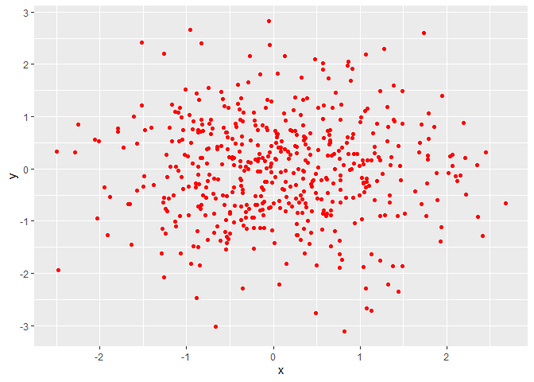
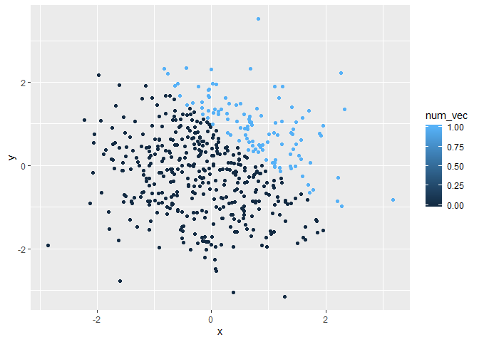
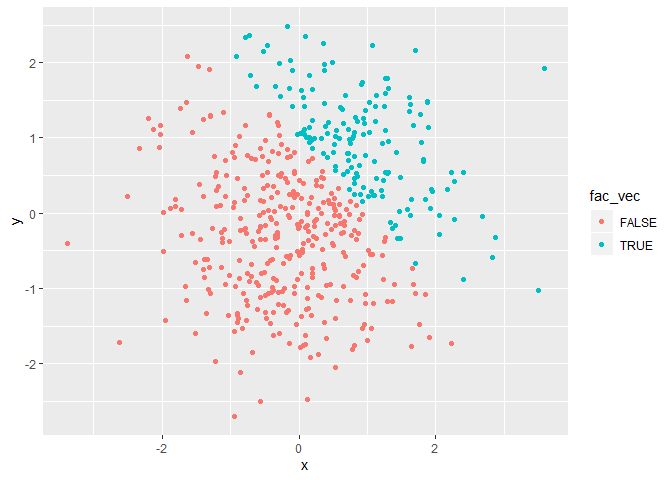

p8105\_hw1\_kq2127
================
Kristal Quispe
9/17/2019

# Problem 1

``` r
p1_df = tibble(
  sample = rnorm(8),
  gr_th_0 = sample > 0, 
  vec_char = c("My", "complete", "full", "name", "is", "Jane", "Reed", "Doe"),
  vec_factor = factor(c("Green", "Red", "Red", "Blue", "Green", "Green", "Blue", "Blue"))
)


mean(pull(p1_df, sample))
```

    ## [1] 0.3811656

``` r
mean(pull(p1_df, gr_th_0))
```

    ## [1] 0.5

``` r
mean(pull(p1_df, vec_char))
```

    ## Warning in mean.default(pull(p1_df, vec_char)): argument is not numeric or
    ## logical: returning NA

    ## [1] NA

``` r
mean(pull(p1_df, vec_factor))
```

    ## Warning in mean.default(pull(p1_df, vec_factor)): argument is not numeric
    ## or logical: returning NA

    ## [1] NA

When I take the mean of the first two variables in my data frame I get a
result. The mean of the variable sample is 0.3811656 and the mean of
variable gr\_th\_0 is 0.5 . I was not able to take the mean of the last
two variables, vec\_char and vec\_factor because these two variables are
not numeric or logical.

``` r
as.numeric(pull(p1_df, gr_th_0))

as.numeric(pull(p1_df, vec_char))

as.numeric(pull(p1_df, vec_factor))
```

When I convert the logical, character, and factor variables into
numeric, the values of the logical variable are converted into 0s and
1s, the values of the factor variable are converted into 1s, 2s, and 3s
and the values of the character variable are converted into NAs. Logical
variables are stored as 0 and 1 on the back end, so it makes sense that
they can be converted into numeric easily. There is no way to store the
character variable into numeric, which is why NA was set for all the
values of the converted character variable. The factor variable assigns
levels, which is why it can convert into numeric values of 1s, 2s, and
3s, but these values do not mean anything and only represent differing
categories/levels. This helps explain why we can take the mean of the
logical variable, but not of the character or factor variables.

``` r
gr_th_0_num = as.numeric(pull(p1_df, gr_th_0))

gr_th_0_num*(pull(p1_df, sample))
```

    ## [1] 1.588175445 0.000000000 0.000000000 0.001019169 0.000000000 0.687280420
    ## [7] 2.172971773 0.000000000

``` r
gr_th_0_fac = as.factor(pull(p1_df, gr_th_0))

gr_th_0_fac*(pull(p1_df, sample))
```

    ## Warning in Ops.factor(gr_th_0_fac, (pull(p1_df, sample))): '*' not
    ## meaningful for factors

    ## [1] NA NA NA NA NA NA NA NA

``` r
gr_th_0_fac_num = as.numeric(as.factor(pull(p1_df, gr_th_0)))

gr_th_0_fac_num*(pull(p1_df, sample))
```

    ## [1]  3.176350890 -0.570177860 -0.138886369  0.002038338 -0.009983357
    ## [6]  1.374560841  4.345943545 -0.681074384

# Problem 2

``` r
p2_df = tibble(
  x = rnorm(500),
  y = rnorm(500),
  gr_th_1 = x + y > 1,
  num_vec = as.numeric(gr_th_1), 
  fac_vec = as.factor(gr_th_1)
)
```

The size of the dataset is 500 rows and 5 columns. The mean of x is
0.1089143, the median of x is 0.0906004, and the standard deviation of x
is 1.0058983. The proportion of cases for which x + y \> 1 is
0.312.

``` r
xy_plot_l = ggplot(p2_df, aes(x = x, y = y, color = gr_th_1)) + geom_point()

xy_plot_l
```

<!-- -->

``` r
xy_plot_n = ggplot(p2_df, aes(x = x, y = y, color = num_vec)) + geom_point()

xy_plot_n
```

<!-- -->

``` r
xy_plot_f = ggplot(p2_df, aes(x = x, y = y, color = fac_vec)) + geom_point()

xy_plot_f
```

<!-- -->

``` r
ggsave("xy_plot.png")
```

    ## Saving 7 x 5 in image

The color scale of the xy plot colored by the logical vector
demonstrates only two color options because the logical vector has two
options: true or false. The color scale of the xy plot colored by the
numeric vector demonstrates a spectrum of light blue to dark blue, but
because the values for the numeric vector are only 0 and 1, we only see
two colors and not a spectrum reflected on the plot. The color scale of
the xy plot colored by the factor vector demonstrates only two color
options because the factor vector has two levels of True and False.
