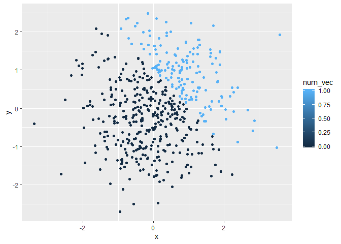

p8105\_hw1\_kq2127
================
Kristal Quispe
9/17/2019

# Problem 1

``` r
p1_df = tibble(
  sample = rnorm(8),
  gr_th_0 = sample > 0, 
  vec_char = c("My", "complete", "full", "name", "is", "Jane", "Reed", "Doe"),
  vec_factor = factor(c("Green", "Red", "Red", "Blue", "Green", "Green", "Blue", "Blue"))
)


mean(pull(p1_df, sample))
```

    ## [1] -0.6279693

``` r
mean(pull(p1_df, gr_th_0))
```

    ## [1] 0.25

``` r
mean(pull(p1_df, vec_char))
```

    ## Warning in mean.default(pull(p1_df, vec_char)): argument is not numeric or
    ## logical: returning NA

    ## [1] NA

``` r
mean(pull(p1_df, vec_factor))
```

    ## Warning in mean.default(pull(p1_df, vec_factor)): argument is not numeric
    ## or logical: returning NA

    ## [1] NA

When I take the mean of the first two variables in my data frame I get a
result. The mean variable sample is -0.6279693 and the mean of variable
gr\_th\_0 is 0.25 . I was not able to take the mean of the last two
variables, vec\_char and vec\_factor because these two variables are not
numeric or logical.

``` r
as.numeric(pull(p1_df, gr_th_0))

as.numeric(pull(p1_df, vec_char))

as.numeric(pull(p1_df, vec_factor))
```

When I convert the logical, character, and factor variables, only the
logical variable is converted into 0s and 1s. The character variable is
converted into NAs and the factor variable is converted into … . This
explains why we were able to take the mean of the logical variable, but
not the mean of the character or factor variables. We can take a mean of
a variable with numeric values of 0s and 1s, but not of NAs.

``` r
gr_th_0_num = as.numeric(pull(p1_df, gr_th_0))

gr_th_0_num*(pull(p1_df, sample))
```

    ## [1] 0.0000000 0.0000000 0.0000000 0.5968268 1.1619265 0.0000000 0.0000000
    ## [8] 0.0000000

``` r
gr_th_0_fac = as.factor(pull(p1_df, gr_th_0))

gr_th_0_fac*(pull(p1_df, sample))
```

    ## Warning in Ops.factor(gr_th_0_fac, (pull(p1_df, sample))): '*' not
    ## meaningful for factors

    ## [1] NA NA NA NA NA NA NA NA

``` r
gr_th_0_fac_num = as.numeric(as.factor(pull(p1_df, gr_th_0)))

gr_th_0_fac_num*(pull(p1_df, sample))
```

    ## [1] -1.3504008 -0.1808372 -2.4357166  1.1936536  2.3238529 -1.4670792
    ## [7] -0.9707894 -0.3776845

# Problem 2

``` r
p2_df = tibble(
  x = rnorm(500),
  y = rnorm(500),
  gr_th_1 = x + y > 1,
  num_vec = as.numeric(gr_th_1), 
  fac_vec = as.factor(gr_th_1)
)
```

The size of the dataset is 500 rows and 5 columns. The mean of x is
-0.0122498, the median is -0.0536408, and the standard deviation of x is
0.9463382. The proportion of cases for which x + y \> 1
is

``` r
xy_plot_l = ggplot(p2_df, aes(x = x, y = y, color = gr_th_1)) + geom_point()

xy_plot_l
```

<!-- -->

``` r
xy_plot_n = ggplot(p2_df, aes(x = x, y = y, color = num_vec)) + geom_point()

xy_plot_n
```

<!-- -->

``` r
xy_plot_f = ggplot(p2_df, aes(x = x, y = y, color = fac_vec)) + geom_point()

xy_plot_f
```

<!-- -->

``` r
ggsave("xy_plot.png")
```

    ## Saving 7 x 5 in image

\`\`\` The color scale of the xy plot colored by the logical vector
demonstrates
